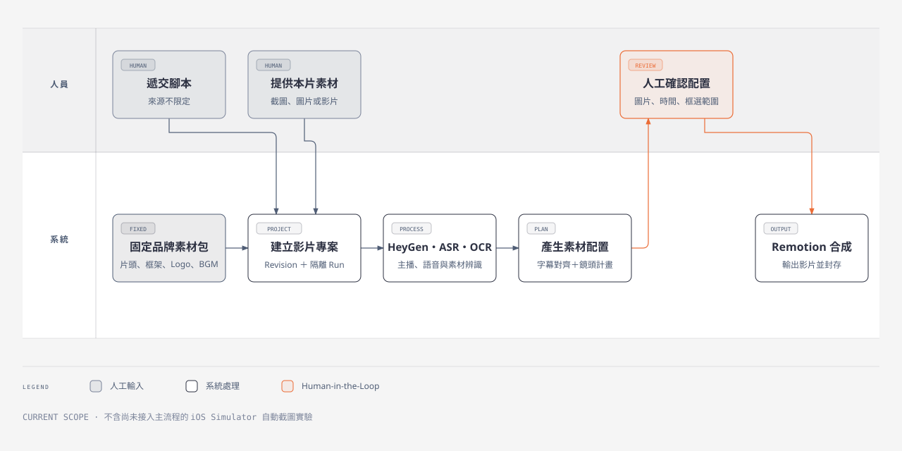
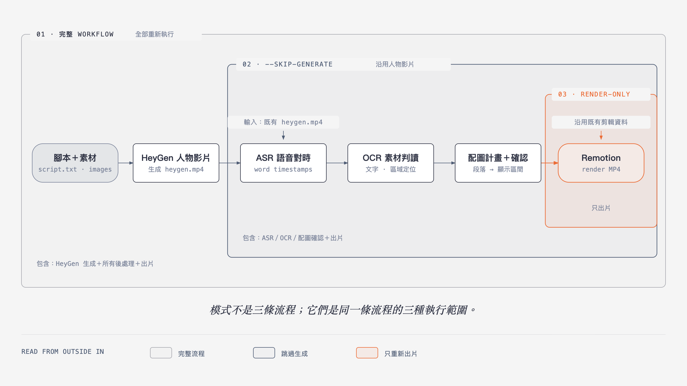

# Marketing Video

將人員遞交的腳本與素材，整理成可確認的素材配置計畫，搭配 HeyGen 人物影片，最後由 Remotion 合成輸出的行銷影片工作流。

## 現行製作流程



影片製作由人員與系統共同完成：

1. 人員從任意腳本來源選擇內容並遞交；系統不限定腳本必須來自 Excel、Google Sheet 或其他特定工具。
2. 人員提供這支影片需要的截圖、圖片或影片；系統另外加入片頭、框架、Logo、BGM 等固定品牌素材。
3. 系統建立製作 Job，保存腳本與本次使用的全部素材。
4. HeyGen 產生 Avatar 主播影片，OCR 同步分析畫面素材，接著完成字幕時間對齊與素材配置計畫。
5. 人員確認或調整圖片、出現時間與框選範圍。
6. Remotion 依確認後的配置合成影片，完成輸出與封存。


## 三種執行範圍



> 這張圖不是製作流程圖，而是說明三種模式會從哪個階段開始，以及會跳過哪些已完成的功能。

| 執行範圍 | 適合情境 | 從哪裡開始 | 會執行的功能 |
|---|---|---|---|
| 完整 Workflow | 只有腳本與素材，需要重新產生人物影片 | `script.txt`＋images | HeyGen 生成、ASR、OCR、素材配置確認與出片 |
| `--skip-generate` | 已有人物影片，不需要重新呼叫 HeyGen | 既有 `heygen.mp4` | ASR、OCR、素材配置確認與出片 |
| `--render-only` | 剪輯資料與素材配置都已確認，只要重新出片 | 既有剪輯資料 | Remotion render |

三種模式共用同一條製作流程。手上的資料越完整，需要重新執行的範圍就越小。

## 目前狀態

目前已確認：

- 乾淨安裝與 localhost UI 可以正常啟動。
- 免費 smoke path 可以建立隔離的測試 job。
- 測試不會呼叫付費 provider 或修改正式素材。
- Git baseline 可以由 `v0.1.0` 還原。

目前尚未由這個 baseline 證明：

- HeyGen 付費生成可以完整重現。
- Whisper、字型與所有品牌素材已在新環境備齊。
- 完整文章到成片流程已達 production readiness。

---

## AI Agent 與維護者操作區

> 開始修改或執行前，先讀 [`AGENTS.md`](AGENTS.md)。它是本 repository 的操作、安全與 evidence boundary。

### 操作順序

1. 讀取 `AGENTS.md` 與本次 request。
2. 執行 `npm run doctor`，區分 localhost 與完整出片缺口。
3. 先以 `npm run smoke` 驗證免費、隔離的 localhost path。
4. 只有使用者明確授權時，才可呼叫付費 provider、開放 LAN 或處理正式素材。

### Localhost 啟動

```bash
nvm install
nvm use
npm ci
npm run doctor
npm run smoke
npm run dev:server
```

開啟 <http://localhost:4000>。預設只監聽 `127.0.0.1`，不對區網開放。

### 核心指令

```bash
npm run doctor                         # localhost 與完整 pipeline preflight
npm run doctor:full                    # 完整出片鏈任一 blocker 都回傳非 0
npm run smoke                          # 免 provider、隔離 fixture job
npm run cleanup:plan -- --root=/path   # 唯讀清理計畫，絕不刪檔
npm run dev:server                     # localhost 使用者前台，port 4000
npm start                              # Remotion Studio，不是使用者前台
```

### 安全與資料邊界

- `npm run smoke` 使用 repo 外的臨時 `DATA_DIR`、停用 worker、清空 provider keys，並阻擋／記錄 child process 與 outbound network 嘗試。
- 正常 job state 預設放在 ignored 的 `runtime-data/`。
- 大型品牌素材不進 Git；本 workspace 的 ignored `assets` symlink 指向 `../data/assets/`。
- 啟動 server 不會自動清理舊 job；只有顯式設定 `AUTO_PRUNE_ON_START=1` 才會 prune。
- 非 localhost 模式目前沒有完整認證，server 會預設拒絕啟動。
- `.env`、`.google-creds.json`、provider cache、正式素材與輸出不得進 Git。

```text
marketing-video/
├── app/                 # Git repository
│   └── assets -> ../data/assets
└── data/
    ├── assets/          # 品牌素材、BGM、outro；不進 Git
    ├── cases/
    ├── history/
    ├── outputs/
    └── runtime/
```

### 手動執行既有 Remotion 流程

```bash
npm run transcribe         # 從 heygen.mp4 抽字幕與偵測秒數
npm run correct-subtitles  # 用 script.txt 修正字幕
npm run parse-script       # 解析標記並產生配圖時間
npm start                  # 開啟 Remotion Studio 預覽
npm run render             # 輸出 out/output.mp4
```

完整 pipeline 需要 FFmpeg、ffprobe、Whisper、Tesseract `chi_tra`、有效字型與對應 provider keys。Whisper 應使用 project-local `.venv/` 與 `.cache/whisper/`，不要安裝成全域 Python package。

### 詳細規格

- [操作與驗收 Runbook](docs/operator-runbook.md)
- [環境基線](docs/environment-baseline.md)
- [輸入檔案與腳本標記](docs/input-contract.md)
- [Remotion 畫面微調](docs/render-customization.md)
- [Milestone 01 驗證邊界](docs/milestone-01.md)
